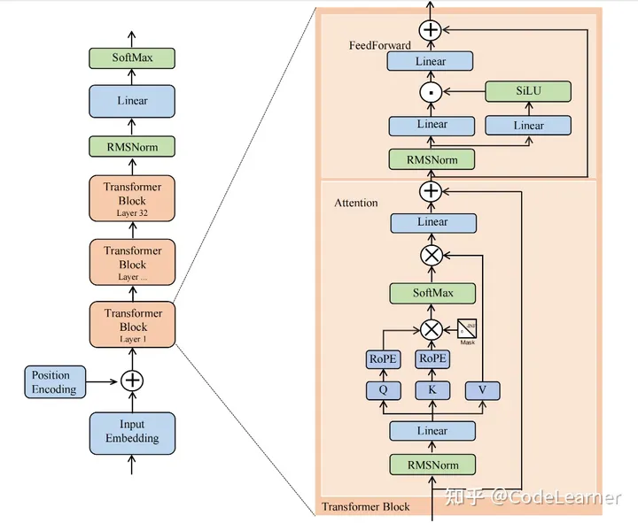
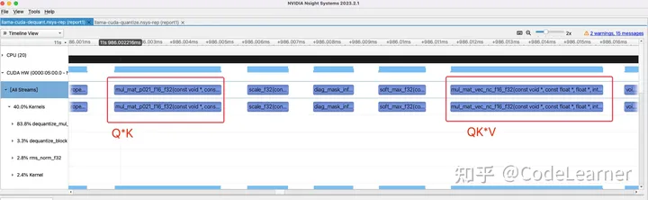
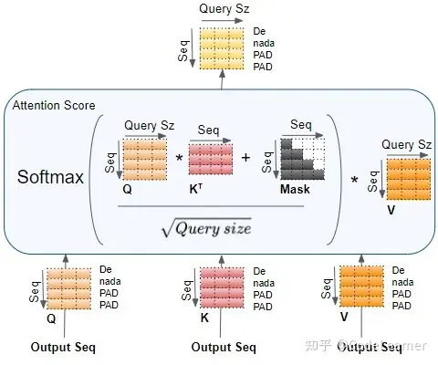
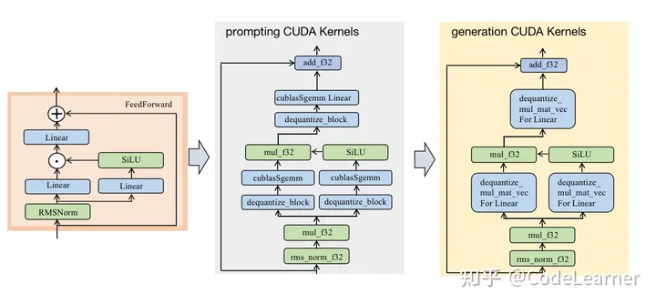

# Llama.cpp.kernels


 blog

> [!info] 知乎 llama.cpp源码解析--CUDA流程版本  
> https://zhuanlan.zhihu.com/p/665027154

Llama 2 7B model



```bash
|-- example
|  |-- main
|     |-- main.cpp  # 推理llama 2的主函数
|-- ggml.c # ggml.c 和.h文件定义一些框架的基础数据结构和函数等
|-- ggml.h
|-- ggml-alloc.c #内存分配管理
|-- ggml-alloc.h
|-- llama.cpp # 整个llama 2的计算图构建和weight加载等
|-- llama.h
|-- ggml-cuda.cu  #cuda版本的llama2 中的kernel实现与调用
|-- ggml-cuda.h
|-- ggml-opencl.cpp #opencl版本的llama2 中的kernel实现与调用
|-- ggml-opencl.h
|-- ... #其他
```

# Attention Block

## rms_norm_f32

$$ RMSNorm:y = \frac{x}{\sqrt{Mean(x^2) +e}} * \gamma  $$
$$Mean(x^2) = \frac{1}{N}\sum\limits_{i=1}^{N}x_i^2$$

> $\gamma$ 为可学习的参数

kernel for $\frac{x}{\sqrt{Mean(x^2) + e}}$

```cpp
static __global__ void rms_norm_f32(const float * x, float * dst, const int ncols, const float eps) {
    const int row = blockIdx.x*blockDim.y + threadIdx.y;
    const int tid = threadIdx.x;
​
    float tmp = 0.0f; // partial sum for thread in warp
    //一个线程求和(ncols/WARP_SIZE)个数据的x^2 
    for (int col = tid; col < ncols; col += WARP_SIZE) {
        const float xi = x[row*ncols + col];
        tmp += xi * xi;
    }
    
    // sum up partial sums
    // 一个线程束(32个线程)内的归约求和
#pragma unroll
    for (int mask = 16; mask > 0; mask >>= 1) {
        tmp += __shfl_xor_sync(0xffffffff, tmp, mask, 32);
    }
    
    const float mean = tmp / ncols; // mean(x^2)
    const float scale = rsqrtf(mean + eps); // 1/根号mean
    //算完之后写回原数组
    for (int col = tid; col < ncols; col += WARP_SIZE) {
        dst[row*ncols + col] = scale * x[row*ncols + col];
    }
}
```

kernel $* \gamma$ 

```cpp
static __global__ void mul_f32(const float * x, const float * y, float * dst, const int kx, const int ky) {
    const int i = blockDim.x*blockIdx.x + threadIdx.x;
​
    if (i >= kx) {
        return;
    }
    dst[i] = x[i] * y[i%ky];
}
```

## Linear Layer 

一个 Transformer Block 中有 7个 Linear 层：生成Q、K、V的三个Linear、Attention Block中最后一个Linear和 FeedForward Block中的3个Linear

Linear Layer 在进行量化推理时可以选用两种方式：
1. 反量化(dequantize Linear) int-8 的 weight，之后将**fp32**的input-tensor与**fp32**的weight进行Linear层的运算
2. 量化(quantize Linear) input-tensor，之后将**int-8**的input-tensor与**int-8**的weight进行Linear层的运算
### dequantize Linear

在 prompting 和 generation 阶段都会被调用
prompting: dequantize_block + cublasSgemm
generation: dequantize_mul_mat_vec

### quantize Linear

对输入 tensor 做量化，然后再与 int8 的 weight 做 int8 的运算。
quantize_q8_1 + mul_mat_vec_q

### rope_f32

```cpp
static __global__ void rope_f32(const float * x, float * dst, const int ncols,
							    const float p0, const float p_delta,
							    const int p_delta_rows, const float theta_scale)
{
	const int col = 2 * (blockDim.x * blockIdx.x + threadIdx.x);
	if (col >= ncols) return;
	const int row = blockDim.y * blockIdx.y + threadIdx.y;
	const int i = row * ncols + col;

	const float theta = (p0 + p_delta * (row / p_delta_rows)) * 
						powf(theta_scale, col/2);
	const float sin_theta = sinf(theta);
	const float cos_theta = cosf(theta);

	const float x0 = x[i+0];
	const float x1 = x[i+1];

	dst[i+0] = x0 * cos_theta - x1 * sin_theta;
	dst[i+1] = x0 * sin_theta + x1 * cos_theta;
}
```

### Copy Kernel

prompting 或 generation 生成的 K V 都是需要缓存，区别是 prompting 是将 token 对应的 KV 直接写入，generation 是将单个 token 对应的 KV 追加至 KV cache，可以将 FP32 转成 FP16 再缓存，但是会损失一定精度

``` cpp
// fp32 -> fp32
static __device__ void cpy_1_f32_f32(const char *cxi, char * cdsti) {
	const float * xi = (const float*) cxi;
	float *dsti = (float *) cdsti;

	*dsti = *xi;
}

// fp32 -> fp16
static __device__ void cpy_1_f32_f16(const char* cxi, char * cdsti) {
	const float *xi = (const float *) cxi;
	half * dsti = (half *) cdsti;

	*dsti = __float2half(*xi);
}
```


```cpp
template <cpy_kernel_t cpy_1>
static __global__ void cpy_f32_f16(const char * cx, char * cdst, const int ne,
                                   const int ne00, const int ne01, const int nb00, const int nb01, const int nb02,
                                   const int ne10, const int ne11, const int nb10, const int nb11, const int nb12) {
    const int i = blockDim.x*blockIdx.x + threadIdx.x;
​
    if (i >= ne) {
        return;
    }
    // determine indices i02/i12, i01/i11, i00/i10 as a function of index i of flattened tensor
    // then combine those indices with the corresponding byte offsets to get the total offsets
    // 结合之前的ggml_tensor的ne 和 nb的定义
    // nb[i] = nb[i-1] * ne[i-1] , nb[0] =sizeof(type)
  
    const int i02 = i / (ne00*ne01); //the index of ne02 
    const int i01 = (i - i02*ne01*ne00) / ne00; //the index of ne01 
    const int i00 = i - i02*ne01*ne00 - i01*ne00; //the index of ne00
    const int x_offset = i00*nb00 + i01*nb01 + i02*nb02; //计算偏移
   
    const int i12 = i / (ne10*ne11); //dst同上
    const int i11 = (i - i12*ne10*ne11) / ne10;
    const int i10 = i - i12*ne10*ne11 - i11*ne10;
    const int dst_offset = i10*nb10 + i11*nb11 + i12*nb12;
​
    cpy_1(cx + x_offset, cdst + dst_offset); //将cx[x_offset] 转换为fp16写到cdst[dst_offset]
}
```

### Multi-Head-Attention

$$Attention(Q,K,V) = softmax(\frac{QK^T}{\sqrt{dk}})V$$
7B 模型采用的是 MHA
对于 `Q*K` 和 `AttentionScore*V` 在 prompting 和 generation 调用的算子不一样
prompting: shape `[1,32,seq_len,128]` 直接调用 cublasSgemm
generation: shape `[1,32,1,128]` Q 与新生成的 KV 以及 KV cache 做 self-attention



5 kernels in generation

**Q * K ---- mul_mat_p021_f16_f32**

Q shape `[1,32,1,128]` 
K cache shape `[1,32,seq_len,128]` seq_len 为当前处理的 tokens 的数量

gridDim = {1,seq_len,32} blockDim = {32,1,1}
一个 block 处理 Q 与 K cache 中的一行 K 进行乘加运算

```cpp
// gridDim = {1,seq_len,32} ,blockDim = {32,1,1}
static __global__ void mul_mat_p021_f16_f32(
    const void * __restrict__ vx, const float * __restrict__ y, float * __restrict__ dst,
    const int ncols_x, const int nrows_x, const int nchannels_x, const int nchannels_y) {
​
    const half * x = (const half *) vx; //vx就是K cache
​
    const int row_x = blockDim.y*blockIdx.y + threadIdx.y; //这个维度是seq_len 的索引，[0,..,seq_len-1]
    const int channel = blockDim.z*blockIdx.z + threadIdx.z; //这个维度是multi head的索引[0,1,2..,31]
    const int channel_x = channel / (nchannels_y / nchannels_x);//这个是对于GQA的时候用的，就是Q分组共享K cache
                                                                //此处我们是以7B模型为例，依然是MHA
​
    const int nrows_y = ncols_x;  //128
    const int nrows_dst = nrows_x;//seq_len
    const int row_dst = row_x; //[0,..,seq_len-1]
​
    float tmp = 0.0f;
    //因为一个block(32个线程)处理128个数据，所以每个线程for循环迭代次数为128/32
    for (int col_x0 = 0; col_x0 < ncols_x; col_x0 += blockDim.x) {
        const int col_x = col_x0 + threadIdx.x; //计算列索引[0-127]
​
        if (col_x >= ncols_x) {
            break;
        }
​
        // x is transposed and permuted
        // 计算K cache的index
        // 前面说过K cache在内存存的次序还是[seq_len , multihead , head_dim]
        // 所以这里的index的计算方式 理解一下
        const int ix = row_x*nchannels_x*ncols_x + channel_x*ncols_x + col_x;
        //K cache不是为了节省内存用的FP16存着嘛，所以用一个__half2float内置函数将FP16转换为FP32
        const float xi = __half2float(x[ix]);
        //K cache的列索引 等于 Q的 列索引
        //名字叫row_y但还是列索引，因为Q的内存排布还是[32,128]
        const int row_y = col_x;
​
        // y is not transposed but permuted
        const int iy = channel*nrows_y + row_y;//计算Q的全局index
​
        tmp += xi * y[iy]; //乘后累和到tmp
    }
​
    // dst is not transposed and not permuted
    //dst的shape为[32,1,seq_len] ,所以内存排布为[32,seq_len]
    //所以dst的index计算方式如下
    const int idst = channel*nrows_dst + row_dst;
​
    // sum up partial sums and write back result
    // 又是熟悉的block内求和
#pragma unroll
    for (int mask = 16; mask > 0; mask >>= 1) {
        tmp += __shfl_xor_sync(0xffffffff, tmp, mask, 32);
    }
​
    if (threadIdx.x == 0) {
        dst[idst] = tmp;//写回dst
    }
}
```

**div $\sqrt{dk}$ ---- scale_f32**

```cpp
static __global__ void scale_f32(const float * x, float * dst, const float scale, const int k) {
    const int i = blockDim.x*blockIdx.x + threadIdx.x;
​
    if (i >= k) {
        return;
    }
​
    dst[i] = scale * x[i];
}
```

**attention mask ---- diag_mask_inf_f32**

Attention 中的 mask 操作，在原生的 Transformer Decode 阶段，加入mask是为了<span style="color:#ffc000">防止前面的 token 的Q 与后面 token 的K 计算得到一个较高的 AttentionScore</span>，所以通过一个上三角(且上三角元素全为-INF)矩阵，<span style="color:#ffc000">来保证句子中单词之间的时序性</span>。



generation阶段也调用了`diag_mask_inf_f32`这个kernel，**实际是不需要调用的**。因为生成阶段生成的Q就是最新的单词所对应的Q，他与KV cache中的每个KV 计算的Attention Score都不会mask， mask的操作只需要存在于prompting阶段中，想来这里也是因为llama.cpp的作者为了省事～


```cpp
static __global__ void diag_mask_inf_f32(const float * x, float * dst, const int ncols, const int rows_per_channel, const int n_past) {
    const int col = blockDim.x*blockIdx.x + threadIdx.x;
    const int row = blockDim.y*blockIdx.y + threadIdx.y;
​
    if (col >= ncols) {
        return;
    }
​
    const int i = row*ncols + col;
    // dst[i] = col > n_past + row ? -INFINITY : x[i];
    dst[i] = x[i] - (col > n_past + row % rows_per_channel) * INT_MAX; // equivalent within rounding error but slightly faster on GPU
}
```

**SoftMax**

```cpp
// gridDim = {1,32,1} ,blockDim = {32,1,1}
static __global__ void soft_max_f32(const float * x, float * dst, const int ncols) {
    const int row = blockDim.y*blockIdx.y + threadIdx.y;
    const int block_size = blockDim.x;
    const int tid = threadIdx.x;
    float tmp = 0.0;
    for (int block_start = 0; block_start < ncols; block_start += block_size) {
        const int col = block_start + tid;
        if (col >= ncols) {
            break;
        }
        const int i = row*ncols + col;
        const float val = expf(x[i]);
        tmp += val;
        dst[i] = val;
    }
    // sum up partial sums
#pragma unroll
    for (int mask = 16; mask > 0; mask >>= 1) {
        tmp += __shfl_xor_sync(0xffffffff, tmp, mask, 32);
    }
    for (int block_start = 0; block_start < ncols; block_start += block_size) {
        const int col = block_start + tid;
        if (col >= ncols) {
            break;
        }
        const int i = row*ncols + col;
        dst[i] /= tmp;
    }
}
```

**Attention Score * V ---- mul_mat_vec_nc_f16_f32**

generation阶段Attention Score 的shape为`[1, 32 , 1, seq_len]`，V的shape为`[1, 32 ,seq_len,128]`
gridDim={1,128,32} ，blockDim={32,1,1}
所以 blockDim.z维度对应于multihead=32 维度，blockDim.y维度对应于head_dim=128维度，然后每个block中32个线程用来处理每个seq_len长度序列的乘加。

```cpp
//gridDim={1,128,32},blockDim={32,1,1}
static __global__ void mul_mat_vec_nc_f16_f32( // nc == non-contiguous
    const void * __restrict__ vx, const float * __restrict__ y, float * __restrict__ dst, const int ncols_x, const int nrows_x,
    const int row_stride_x, const int channel_stride_x, const int channel_x_divisor) {
    //ncols_x = seq_len, nrows_x=128, row_stride_x=512 , channel_stride_x = 65536, channel_x_divisor=1
​
    const half * x = (const half *) vx; //V cache 存储时使用的FP16
​
    const int row_x = blockDim.y*blockIdx.y + threadIdx.y; // index of head_dim ->  0-127
    const int channel = blockDim.z*blockIdx.z + threadIdx.z; // index of multi-head -> 0-31
    const int channel_x = channel / channel_x_divisor; // channel/1
​
    const int nrows_y = ncols_x; //seq_len
    const int nrows_dst = nrows_x; //128
    const int row_dst = row_x; // index of head_dim ->  0-127
    
    //Attention Score * V 最终的shape为[1,32,1,128]
    //所以idst = （index of multi-head） * (128) + (index of head_dim)
    const int idst = channel*nrows_dst + row_dst; 
​
    float tmp = 0.0f;
    //循环处理seq_len序列，每个线程处理seq_len/blockDim.x 个数
    for (int col_x0 = 0; col_x0 < ncols_x; col_x0 += blockDim.x) {
        const int col_x = col_x0 + threadIdx.x;
​
        if (col_x >= ncols_x) {
            break;
        }
        // V cache的index
        const int ix = channel_x*channel_stride_x + row_x*row_stride_x + col_x;
        //fp16转fp32
        const float xi = __half2float(x[ix]);
        // Attention Score index
        const int row_y = col_x;
        const int iy = channel*nrows_y + row_y;
​
        tmp += xi * y[iy]; //乘加
    }
​
    // sum up partial sums and write back result
    //还是熟悉的block内部求和
#pragma unroll
    for (int mask = 16; mask > 0; mask >>= 1) {
        tmp += __shfl_xor_sync(0xffffffff, tmp, mask, 32);
    }
    //结果写回
    if (threadIdx.x == 0) {
        dst[idst] = tmp;
    }
}
```

### add_f32

用于残差连接 下一输入 tensor 与 Attention Block 的输出，简单向量相加

```cpp
static __global__ void add_f32(const float * x, const float * y, float * dst, const int kx, const int ky) {
    const int i = blockDim.x*blockIdx.x + threadIdx.x;
​
    if (i >= kx) {
        return;
    }
    dst[i] = x[i] + y[i%ky];
}
```

tensor shape `[1,1,4096]` 
Attention Block shape `[1,1,4096]` 
# FeedForward Block



Linear and silu

### silu_f32

$$SiLU(x)=x*Sigmoid(x)=\frac{x}{1+e^{-x}}$$

```cpp
static __global__ void silu_f32(const float * x, float * dst, const int k) {
    const int i = blockDim.x*blockIdx.x + threadIdx.x;​
    if (i >= k) {
        return;
    }
    //silu公式
    dst[i] = x[i] / (1.0f + expf(-x[i]));
}
```

prompting 与 generation 阶段的 blockSize 不同，FeedForward Block 中前两个 Linear 层中的输出尺寸是 11008，所以需要prompting_length * 11008 个线程处理 prompting_length * 11008 个数据。generation 则是 11008 个线程处理 11008 个数据

